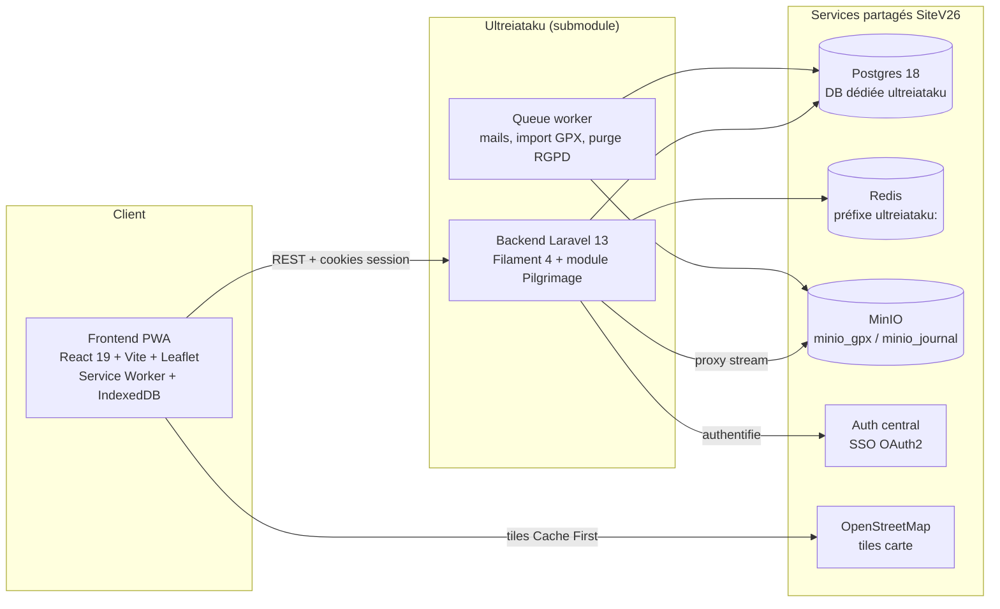
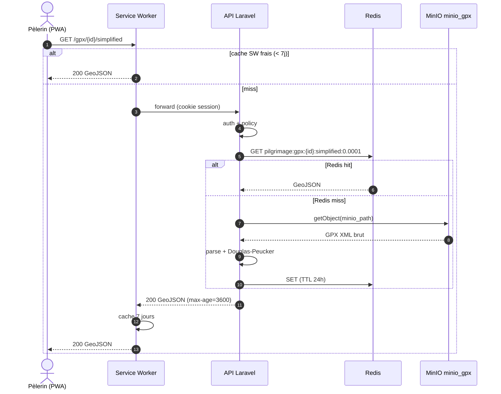
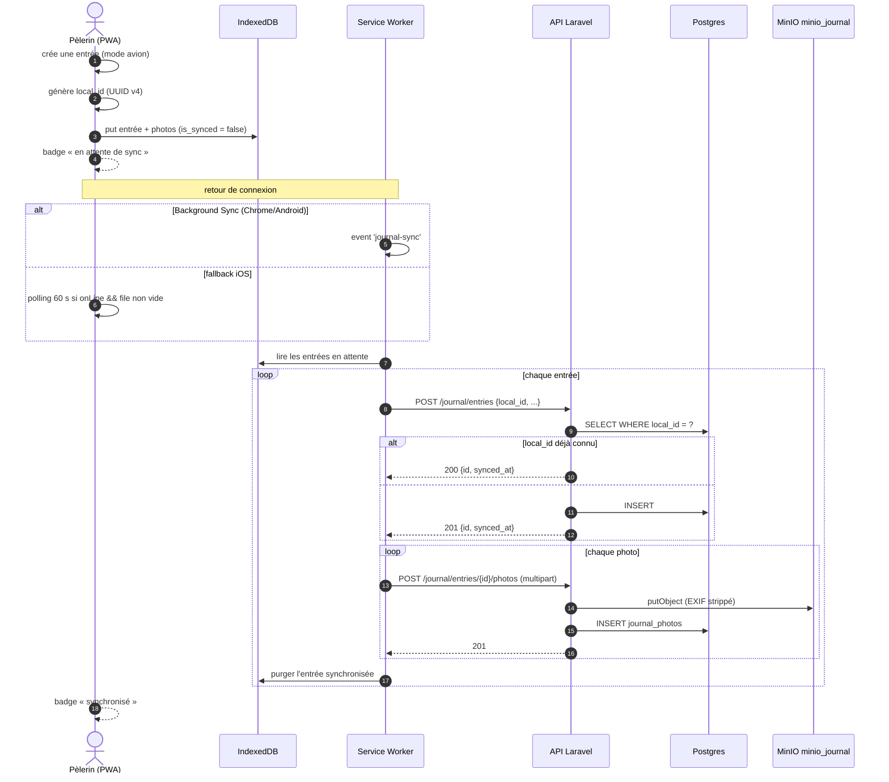
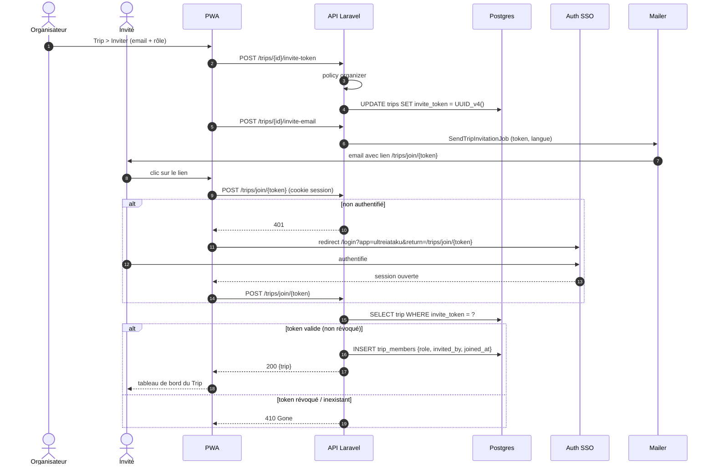

# Architecture — Ultreiataku

Synthèse des décisions d'architecture, du modèle de données et des flux critiques d'Ultreiataku.

Ce document vulgarise les artefacts amont produits par l'architecte : ADRs `ADR-U01` à `ADR-U06`, ERD des 15 entités, diagrammes C4. Il ne remplace pas les ADRs sources (`reports/architecture/ultreiataku/2026-07-24_adrs.md`) mais en donne la version opérationnelle pour un développeur qui prend le module en main.

---

## Sommaire

- [1. Vue d'ensemble](#1-vue-densemble)
- [2. Décisions d'architecture (ADRs)](#2-décisions-darchitecture-adrs)
- [3. Modèle d'authentification — cookies de session](#3-modèle-dauthentification--cookies-de-session)
- [4. ERD — les 15 entités](#4-erd--les-15-entités)
- [5. Flux critiques](#5-flux-critiques)

---

## 1. Vue d'ensemble

Ultreiataku est une PWA offline-first composée de deux applications et de services partagés du monorepo SiteV26.



Le contenu du Chemin (routes, étapes, waypoints, hébergements, repas) est **public et pré-cachable** pour un usage hors connexion. Les données personnelles (trips, journal, sac) exigent une session et passent par les Policies.

---

## 2. Décisions d'architecture (ADRs)

| ADR | Décision | Pourquoi | Conséquence principale |
| --- | --- | --- | --- |
| **U01** | Base Postgres **dédiée** `ultreiataku` dans le cluster partagé `site-pgsql`, tables sans préfixe ni schema custom. | Chaque backend du monorepo a sa propre DB : isolation forte, zéro collision, dump/restore indépendant, aucun coût (pattern déjà appliqué 7 fois). | `CREATE DATABASE ultreiataku` explicite avant `migrate` ; modèles Eloquent sans `$table` personnalisé. |
| **U02** | **Disks MinIO dédiés** : `minio_gpx` (traces), `minio_journal` (photos), `minio_images` (avatars/POI), tous **privés**, servis par proxy backend. | Isolation des quotas et policies par bucket ; jamais `disk('public')` ; conformité RGPD (cascade + purge). | 3 configs S3 dans `filesystems.php` ; endpoints proxy `/gpx/{id}`, `/journal/photos/{id}` ; `PurgePilgrimAssetsJob` à la suppression compte. |
| **U03** | Occupation des hébergements = **table matérialisée** `occupancies` peuplée par `OccupancyObserver`. | Lectures fréquentes (détail hébergement, widget admin), volume faible (~5 400 lignes max) → lecture indexée `< 5 ms` avec cohérence immédiate. | Observer réagit à `Departure` et pivot `trip_members` ; recalcul du sous-ensemble impacté ; commande de rebuild + job de secours. |
| **U04** | Sync offline du journal = **IndexedDB + Background Sync API + fallback polling 60 s**, idempotence backend par `local_id`. | Tolère un conflit résolu en last-write-wins ; évite la complexité CRDT ; s'intègre au Service Worker déjà requis pour les tiles. | `local_id` UNIQUE (partiel `WHERE NOT NULL`) ; `POST` idempotent (`200` si `local_id` connu, `201` sinon) ; fallback iOS car Background Sync absent de Safari. |
| **U05** | Cache **Redis** des traces GPX simplifiées, clé `pilgrimage:gpx:{id}:simplified:{tolerance}`, TTL 24h, invalidation à l'import. | Simplification Douglas-Peucker CPU-bound mais déterministe ; Redis déjà présent ; ~150 KB total ; latence requête chaude `< 2 ms`. | `GpxSimplificationService` avec `Cache::remember` ; `GpxTraceObserver` invalide les clés ; dégradation gracieuse si Redis indisponible. |
| **U06** | Intégration SSO Filament = **pattern SiteV26** : pas de login natif, redirection frontend + callback `/admin/sso/callback`. | Aligne l'anti-pattern documenté (`->login()` natif interdit) ; pas de comptes locaux dupliqués ; cohérence Auth central. | Panel `->login(false)` + middleware de redirection ; `?app=ultreiataku` obligatoire ; CORS credentials ; CSP `unsafe-inline` + `unsafe-eval`. |

> **Note d'implémentation — auth API.** L'ADR-U06 mentionnait des Bearer tokens pour le SPA. L'implémentation retenue (P0-01, `SEC-ULTREIA-AUTH`) a **abandonné le guard `api` driver session au profit de cookies de session** (middlewares `web` + `auth`, guard `web`), identique au pattern Oikotaku. C'est le modèle décrit à la section 3 — il fait foi. Aucun Bearer token n'est stocké côté client.

---

## 3. Modèle d'authentification — cookies de session

Ultreiataku ne gère aucun compte local. L'authentification est déléguée au projet **Auth central** de SiteV26.

**Principe.** Après authentification SSO, le backend Ultreiataku ouvre une **session serveur** et pose un **cookie de session** (chiffré, `HttpOnly`). Les appels API du SPA transportent ce cookie (`credentials: 'include'`) ; il n'y a pas de token en `localStorage`, ce qui neutralise par construction le risque de vol de token via XSS.

**Routes.**

- Routes publiques (contenu du Chemin) : aucun middleware d'auth.
- Routes protégées : middleware `web` (démarre la session, `StartSession`) + `auth` (résout le guard `web` par défaut). Le guard `api` driver session a été retiré de `config/auth.php`.

**Provisioning du pèlerin.** Au premier accès authentifié (`GET /api/pilgrimage/me`, ou callback Filament), un profil `Pilgrim` est créé automatiquement, lié au `user_id` SSO (`firstOrCreate`).

**Panel Filament.** `/admin` ne rend pas de formulaire natif : il redirige vers `/login?app=ultreiataku&return=/admin/sso/callback`. Le frontend authentifie via Auth, puis le callback backend hydrate la session Filament (guard `web`) et redirige vers le tableau de bord.

**Points de vigilance (contrat SSO monorepo).**

- CORS d'Auth doit whitelister l'origine Ultreiataku avec `credentials: true`.
- L'app `ultreiataku` doit exister dans la table `apps` d'Auth.
- Permissions `600` sur les clés OAuth ; hairpin Docker à gérer (`host.docker.internal`).
- CSP du panel Filament : `unsafe-inline` + `unsafe-eval` obligatoires, sinon menu vide.

---

## 4. ERD — les 15 entités

```mermaid
erDiagram
    pilgrimage_routes ||--o{ stages : "étapes ordonnées"
    pilgrimage_routes ||--o{ trips : "parcourue par"
    stages ||--o| waypoints : "start_waypoint"
    stages ||--o| waypoints : "end_waypoint"
    stages }o--o{ waypoints : "stage_waypoint (POI)"
    stages ||--o{ accommodations : "possible"
    stages ||--o{ meals : "planifié"
    stages ||--o{ gpx_traces : "traces"
    stages ||--o{ departures : "start/end stage"
    stages ||--o{ journal_entries : "liée (nullable)"
    waypoints ||--o{ accommodations : "située à"
    waypoints ||--o{ meals : "à"
    waypoints ||--o{ gpx_traces : "détour vers"

    pilgrims ||--o{ trips : "organise"
    pilgrims }o--o{ trips : "trip_members (rôle)"
    pilgrims ||--o{ departures : "part"
    pilgrims ||--o{ pack_scenarios : "possède"
    pilgrims ||--o{ journal_entries : "rédige"

    trips ||--o{ departures : "contient"
    trips ||--o{ journal_entries : "contient"
    trips ||--o{ occupancies : "génère"

    departures ||--o{ item_assignments : "porte"
    departures }o--o| pack_scenarios : "utilise"

    pack_scenarios ||--o{ pack_items : "contient"
    pack_items ||--o{ item_assignments : "assigné"

    accommodations ||--o{ occupancies : "occupé le"

    journal_entries ||--o{ journal_photos : "photos"

    pilgrimage_routes {
        uuid id PK
        string slug UK
        json name_i18n
        enum country "BE, FR, ES"
        decimal total_distance_km
        bool is_active
    }
    stages {
        uuid id PK
        uuid route_id FK
        string code UK "XX-NN"
        int day_number
        uuid start_waypoint_id FK
        uuid end_waypoint_id FK
        decimal distance_km
        enum difficulty
    }
    waypoints {
        uuid id PK
        string slug UK
        enum type "city, poi, water, ..."
        enum poi_category "nullable"
        decimal latitude
        decimal longitude
        enum detour_type "nullable"
        timestamp verified_at
    }
    accommodations {
        uuid id PK
        uuid stage_id FK "nullable"
        uuid waypoint_id FK "nullable"
        enum type "gite, camping, abbey, ..."
        bool is_primary
        bool bivouac_legal
        timestamp verified_at
    }
    meals {
        uuid id PK
        uuid stage_id FK
        enum meal_type
        enum meal_context
        int kcal_estimate
    }
    pilgrims {
        uuid id PK
        int user_id FK UK "SSO"
        string display_name
        enum preferred_locale "fr, nl, de"
        enum configuration "solo, duo"
    }
    trips {
        uuid id PK
        uuid route_id FK
        uuid organizer_id FK
        enum status
        bool is_public
        string invite_token UK "nullable"
    }
    trip_members {
        uuid trip_id FK
        uuid pilgrim_id FK
        enum role "organizer, participant, observer"
        uuid invited_by FK "nullable"
    }
    departures {
        uuid id PK
        uuid trip_id FK
        uuid pilgrim_id FK
        uuid start_stage_id FK
        uuid end_stage_id FK
        date planned_start_date
        enum status
        uuid pack_scenario_id FK "nullable"
    }
    occupancies {
        uuid id PK
        uuid accommodation_id FK
        date date
        uuid trip_id FK
        int count
    }
    pack_scenarios {
        uuid id PK
        uuid pilgrim_id FK
        decimal target_base_weight_kg
        enum configuration
        enum season
    }
    pack_items {
        uuid id PK
        uuid pack_scenario_id FK
        enum category
        int weight_g
        bool is_shared
        bool is_consumable
    }
    item_assignments {
        uuid id PK
        uuid pack_item_id FK
        uuid departure_id FK
        uuid assigned_to_pilgrim_id FK
        uuid from_stage_id FK "nullable"
        uuid to_stage_id FK "nullable"
    }
    gpx_traces {
        uuid id PK
        uuid stage_id FK "nullable"
        uuid waypoint_id FK "nullable"
        enum trace_type "stage_main, detour, variant"
        string minio_path
        string minio_disk
        enum precision
    }
    journal_entries {
        uuid id PK
        uuid trip_id FK
        uuid pilgrim_id FK
        uuid stage_id FK "nullable"
        enum visibility "private, members, public"
        enum mood "nullable"
        bool is_synced
        string local_id UK "nullable"
    }
    journal_photos {
        uuid id PK
        uuid journal_entry_id FK
        string minio_path
        string minio_disk
        string alt_text
        decimal latitude
        decimal longitude
        bool is_synced
    }
```

> Le modèle `PilgrimageRoute` (table `pilgrimage_routes`) porte ce nom pour éviter la collision avec la façade `Illuminate\Support\Facades\Route`. Le détail champ par champ est dans [`DATA_MODEL.md`](DATA_MODEL.md).

---

## 5. Flux critiques

### 5.1 Proxy GPX simplifié (RG-04 + RG-06, ADR-U05)

Une trace GPX n'est jamais servie directement depuis MinIO : le backend vérifie les droits, puis renvoie une version simplifiée mise en cache.



### 5.2 Synchronisation du journal offline (RG-05, ADR-U04)

L'entrée créée hors connexion est stockée localement, puis synchronisée de façon idempotente au retour du réseau.



### 5.3 Invitation à un Trip (RG-07)

L'organisateur génère un token révocable ; l'invité rejoint après passage par le SSO si nécessaire.



---

## Références

- ADRs sources : `reports/architecture/ultreiataku/2026-07-24_adrs.md`
- Architecture détaillée (C4, arborescences, contrats) : `reports/architecture/ultreiataku/2026-07-24_architecture.md`
- Specs fonctionnelles : `reports/product/ultreiataku/2026-07-24_functional-specs.md`
- Modèle de données : [`DATA_MODEL.md`](DATA_MODEL.md)
- Référence API : [`API.md`](API.md)
